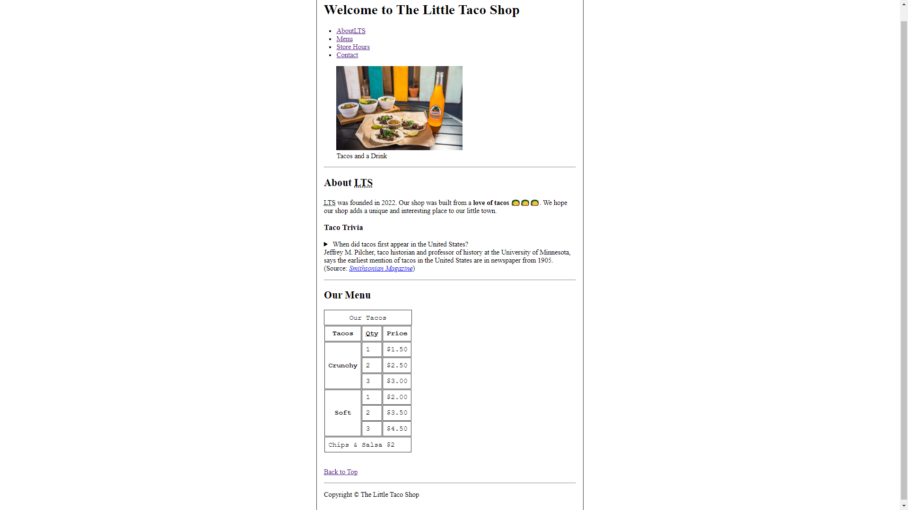
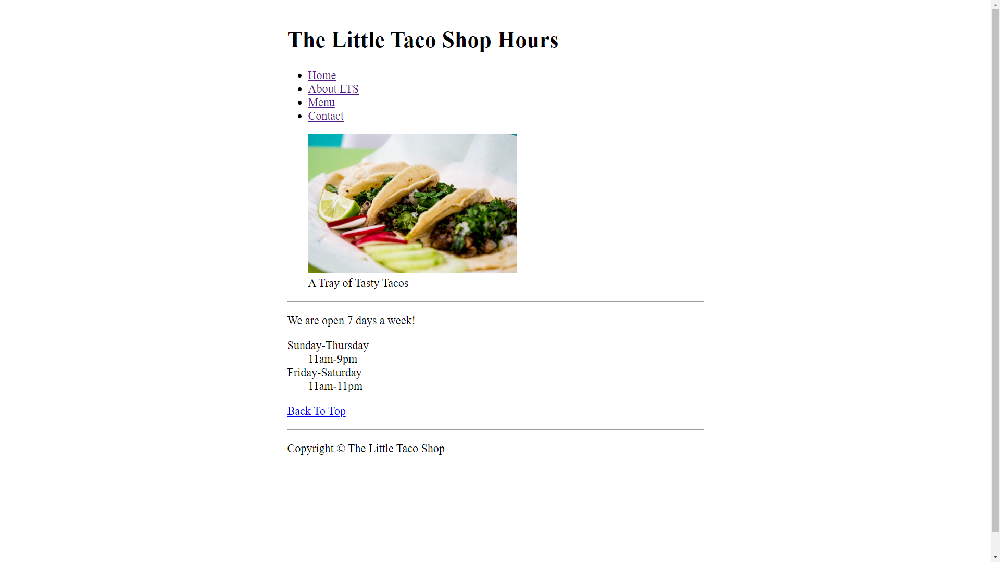
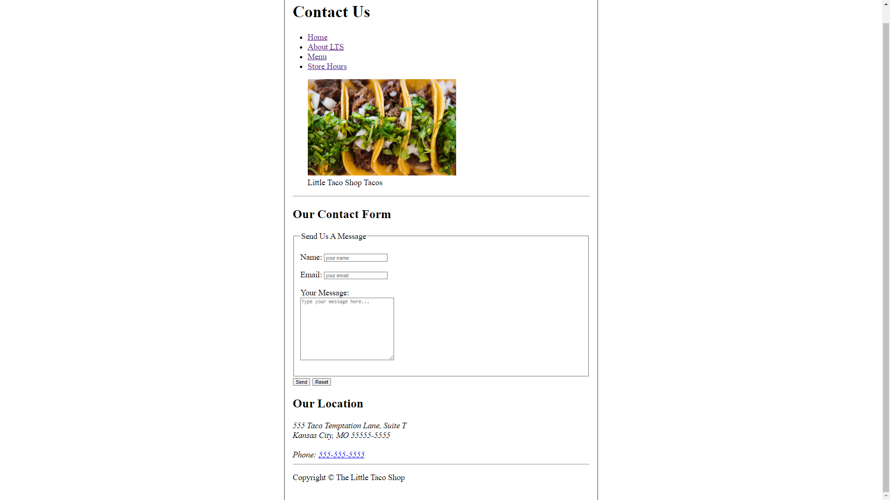

# The Little Taco Shop

[](https://github.com/eduardoalsilva/little-taco-shop/blob/main/LICENSE)

## Sobre o projeto/curso

https://github.com/eduardoalsilva/little-taco-shop

Este é o projeto final do curso de HTML da FreeCodeCamp. O principal objetivo do projeto é aplicar todo o conhecimento adquirido durante o curso. 
O projeto foi desenvolvido para a loja fictícia The Little Taco Shop, que vende tacos. São 3 páginas e em cada uma delas são utilizados diferentes tags e recursos como o forms na página de contato, por exemplo. A página é quase HTML puro, a não ser por poucos ajustes no CSS apenas para ter uma aparência mais agradável e boa para visualizar como o uso dos elementos HTML alteram a posição deles no site.


# Tecnologias utilizadas

- HTML
- CSS


# Visual e design do projeto








# Como executar os códigos

```bash
# clonar repositório
git clone git@github.com:eduardoalsilva/little-taco-shop.git

# entrar na pasta do projeto little-taco-shop
cd little-taco-shop

# executar o código
start index.html
```

# Autor

Eduardo Almeida da Silva

[LinkedIn](https://www.linkedin.com/in/eduardo-almeida-da-silva-dev/)

[Portfólio](https://eduardoalsilva.github.io/)
